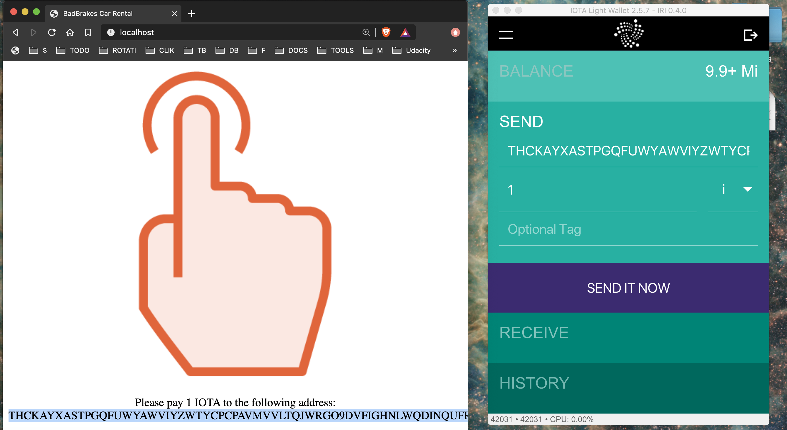

# IOTA Payment Example: Basic Car Rental Payment App

## A simple micro payment app using IOTA

This application was taken from the [IOTA Fundamentals Course](https://app.pluralsight.com/library/courses/iota-fundamentals/table-of-contents) available on [Pluralsight](https://pluralsight.com). In this app we are creating new addresses dynamically and using these new addresses to make a payment that then unlocks a rental car!

## Run the application

To run this application, install the dependencies and then use node to run the application. This has been tested using Node v12.14.1.

```
npm install
node app.js
```

Add **your own seed** to the [app.js](./app.js) file. Then run the app from the terminal using

```
node app.js
```

## Make a payment using your IOTA wallet

Once the application UI updates with the IOTA address where to make the payment then head over to your local IOTA wallet, pate the address there and click 'SENT IT NOW' button. See below screen capture.



You will need to wait for the transfer to process and for it to be confirmed on the Tangle before the car is unlocked and the web UI will update automatically to reflect that.

## View the transaction on the Tangle Explorer

If you used a real address in the app then you can view this transaction using the [Tangle Explorer](https://comnet.thetangle.org/). Make a note of the hash value that was output from the app and use that to look up your transaction. Additionally, if you are using your own address you will be able to see this transaction in your local IOTA Wallet.

### Issue Reporting

If you experience any bugs or need further improvement, please create a new issue under [Issues](https://github.com/jensendarren/iota-payment-example/issues).

### Disclaimer

This application is part of a _research assignment_ and is most definitely __not__ suitable for Production use! :)